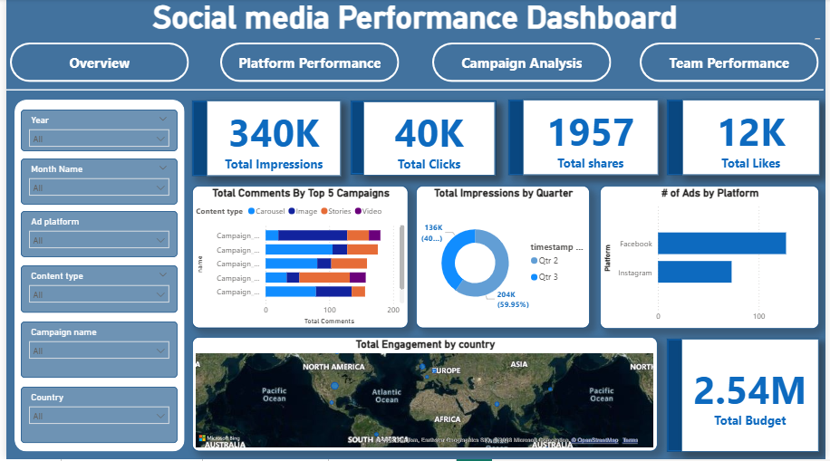

# Social Media Analytics Dashboard (Power BI)

This project analyzes social media data using Power BI to understand user engagement, trends, and performance metrics.

## Tools Used
- Power BI
- Excel / Dataset

## Key Features
- Engagement analysis (likes, shares, comments)
- Platform-wise performance comparison
- Trend analysis over time
- KPI metrics for overall performance

## Dashboard Preview

